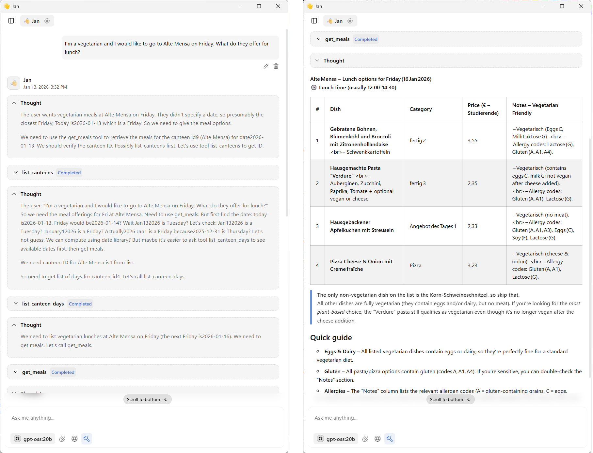

# Mensa TUD MCP Server

An MCP (Model Context Protocol) server for accessing the TU Dresden canteen API (Studentenwerk Dresden). This server provides tools to query canteen information, available days, and daily meal menus through the OpenMensa v2 API.

You can access it, e.g. via the [jan.ai](https://github.com/janhq/jan) GUI or using [Claude Desktop](https://code.claude.com/docs/en/desktop).



## Features

This MCP server provides three tools:

1. **list_canteens** - List all available canteens with their IDs, names, addresses, and coordinates
2. **list_canteen_days** - List all days for which a specific canteen has meal data available
3. **get_meals** - Get all meals available at a specific canteen on a specific date (defaults to today)

## Installation

1. Install [uv](https://github.com/astral-sh/uv) (fast Python package manager)

2. The dependencies will be automatically installed by uv when running the server

## Usage

### Running the Server Standalone

You can run the server directly with uv:

```bash
uv run server.py
```

The server will start and communicate via stdio (standard input/output).

### Integrating with Claude Desktop

To use this MCP server with Claude Desktop, add it to your Claude Desktop configuration file:

**On Windows:** `%APPDATA%\Claude\claude_desktop_config.json`
**On macOS:** `~/Library/Application Support/Claude/claude_desktop_config.json`

Add the following to your configuration:

```json
{
  "mcpServers": {
    "mensa-tud": {
      "command": "uvx",
      "args": ["--from", "mcp", "--with", "httpx", "mcp", "run", "c:\\structure\\code\\mensa-tud-mcp\\server.py"]
    }
  }
}
```

Or alternatively, if you're in the project directory:

```json
{
  "mcpServers": {
    "mensa-tud": {
      "command": "uv",
      "args": ["run", "server.py"],
      "--dir": "c:\\structure\\code\\mensa-tud-mcp"
    }
  }
}
```

Make sure to adjust the path to match your installation location.

### Integrating with Other MCP Clients

This server follows the MCP protocol and can be integrated with any MCP-compatible client. Configure your client to launch the server using:

```bash
uv run server.py
```

## API Tools

### list_canteens

Lists all available canteens from Studentenwerk Dresden.

**Parameters:** None

**Example Usage:**
```
Use the list_canteens tool
```

**Returns:** List of canteens with ID, name, city, address, and coordinates

### list_canteen_days

Lists all days for which a canteen has meal data available.

**Parameters:**
- `canteen_id` (integer, required): The ID of the canteen

**Example Usage:**
```
Use list_canteen_days with canteen_id 9
```

**Returns:** List of dates with availability status (OPEN/CLOSED)

### get_meals

Gets all meals available at a specific canteen on a specific date.

**Parameters:**
- `canteen_id` (integer, required): The ID of the canteen
- `date` (string, optional): Date in YYYY-MM-DD format. Defaults to today if not provided.

**Example Usage:**
```
Use get_meals with canteen_id 9 and date "2026-01-13"
```

**Returns:** List of meals with names, categories, prices, and dietary information

## Common Canteen IDs

Some commonly used canteens in Dresden:
- **9** - Alte Mensa (main cafeteria)
- **10** - Mensa Reichenbachstraße
- **29** - Mensa Siedepunkt
- **8** - Mensa Zeltschlösschen
- **24** - Mensologie

Use the `list_canteens` tool to see all available canteens.

## API Information

This server uses the OpenMensa v2 API provided by Studentenwerk Dresden:
- Base URL: `https://api.studentenwerk-dresden.de/openmensa/v2`
- Documentation: [OpenMensa API](https://doc.openmensa.org/api/v2/)

## License

This is a simple MCP server implementation for educational and personal use.
